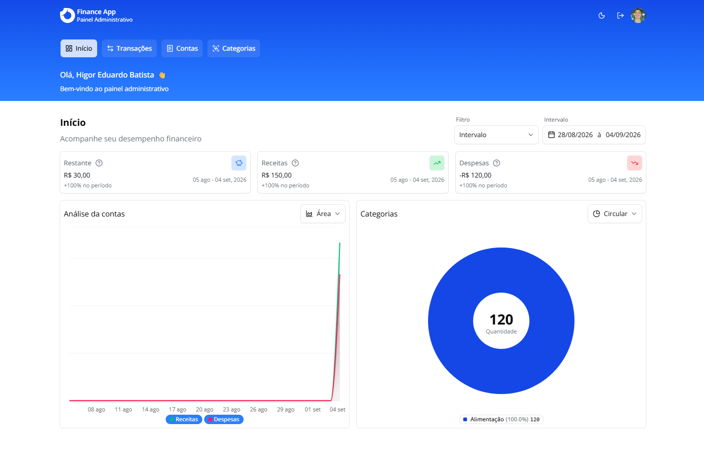

> :fire: Development

```bash
docker compose up -d && yarn && yarn db:migrate && yarn dev
```

> :gear: Environment Variables

- PostgreSQL URL: `DATABASE_URL`

- Secret (session/JWT): `AUTH_SECRET`

- App URL: `NEXT_PUBLIC_APP_URL`

- reCAPTCHA private key: `RECAPTCHA_PRIVATE_KEY`
- reCAPTCHA site key (public): `NEXT_PUBLIC_RECAPTCHA_SITE_KEY`
- reCAPTCHA verification endpoint: `RECAPTCHA_ENDPOINT`

- Google OAuth client ID: `GOOGLE_CLIENT_ID`
- Google OAuth client secret: `GOOGLE_CLIENT_SECRET`

- SMTP host: `SMTP_EMAIL_HOST`
- SMTP port: `SMTP_EMAIL_PORT`
- SMTP secure (TLS): `SMTP_SECURE`
- SMTP user: `SMTP_EMAIL_USER`
- SMTP password: `SMTP_EMAIL_PASS`


